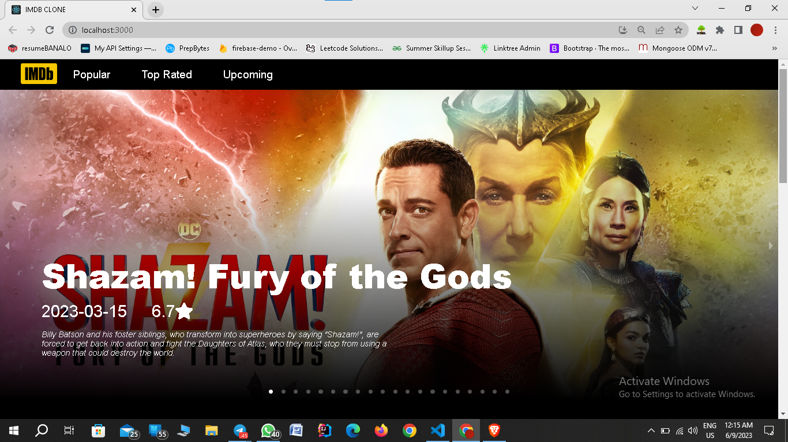
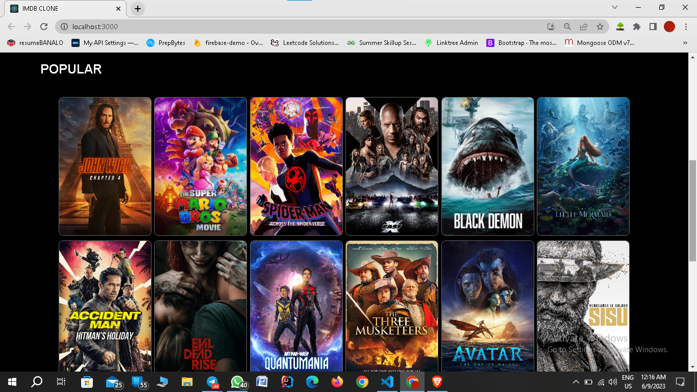
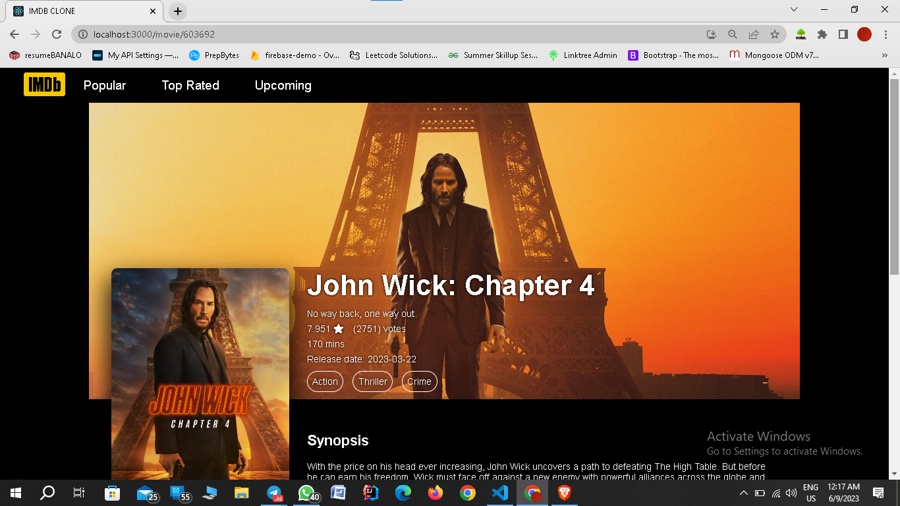

# IMDB-CLONE
In this project, I have created an IMDB clone using ReactJS.
This React project will provide us the list of upcoming, popular & top rated movies. On clicking on any movie it will show us the detail page of the movie.
This React app also have a caraousel at the top for displaying movies as hero banner.

💻Technologies used:  

  ✨ReactJs
  
  ✨React Router Dom
  
  ✨React Loading Skeleton 
  
  ✨React Responsive Caraousel
  
  ✨Font Awesome
  
  Useful Link In Building A Movies App  IMDB Clone  React App :-

  ✨ TMDb: The Movie Database API - https://www.themoviedb.org/settings/api/{key}
  
  

   
  
  
  
  
  

  
  
